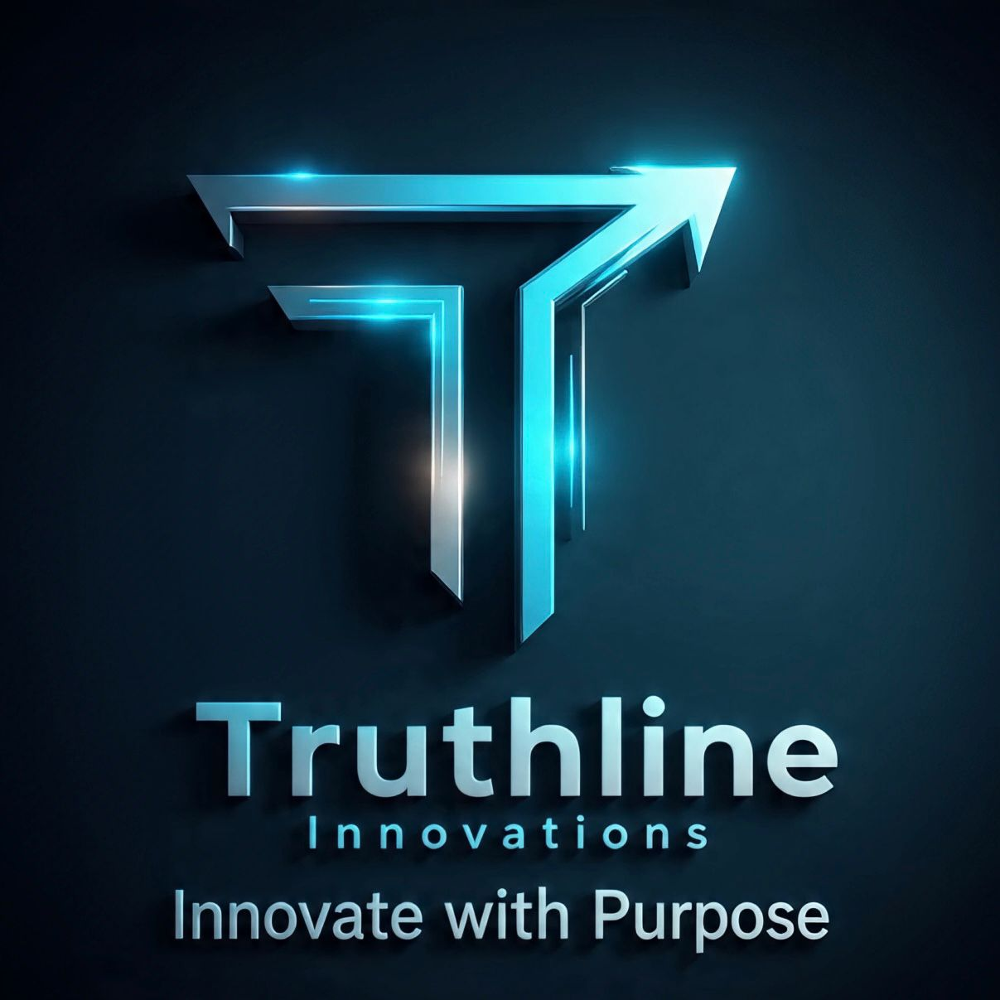

  

Evans Kofi Assafuah

<h3 align="center">
🚀 Full Stack Developer • 📱 Mobile App Developer • 🤖 AI Solutions Builder • 🖥 IT Support Specialist
</h3>

---

## 👨‍💻 About Me

> Passionate developer focused on **scalable web systems, mobile apps, AI-powered solutions, and business automation**.  
> I build products that solve real problems and create measurable value.

---

## 🔥 What I Bring

✔ Responsive Frontend Design  
✔ Backend Development  
✔ Database Systems  
✔ IT Support & Troubleshooting  
✔ Problem Solving Mindset  
✔ Fast Learner & Team Player  

---

## 🎯 Currently Focused On

- 🌱 Flutter Mobile App Development  
- 🤖 AI Powered Web Systems  
- ☁️ Cloud Infrastructure  
- 🔐 Cybersecurity Fundamentals  
- ⚡ Performance Optimization  

---

## 🛠 Tech Stack

### 🌐 Frontend

### ⚙️ Backend

### 🗄 Database

### ☁️ Tools & DevOps

---

## 📌 Featured Projects

<table>
<thead>
<tr>
<th>Project</th>
<th>Description</th>
<th>Technologies Used</th>
</tr>
</thead>
<tbody>

<tr>
<td>💼 <em>Digital Solutions For MSMEs</em></td>
<td>Built digital solutions for 5+ small & medium businesses</td>
<td>HTML5 • Firebase • JS</td>
</tr>

<tr>
<td>🕒 <em>Real-Time Attendance Web App</em></td>
<td>Attendance system for 100+ users with automated reporting</td>
<td>React • Supabase • API • Twilio</td>
</tr>

<tr>
<td>🎓 <em>Full Student Management Hub</em></td>
<td>News, Timetable, E-commerce & Resources</td>
<td>PHP • MySQL • Responsive Design</td>
</tr>

<tr>
<td>🛒 <em>Shopping Cart Web App</em></td>
<td>Complete shopping system with cart logic & backend integration</td>
<td>PHP • MySQL • Bootstrap</td>
</tr>

<tr>
<td>🌍 <em>NGO Website</em></td>
<td>Donation platform with MoMo & Visa payment system</td>
<td>PHP • Paystack • Tailwind</td>
</tr>

</tbody>
</table>

---

## 🖼 Project Showcase

---

## 🤝 Open to Opportunities

✅ Internship Roles  
✅ Remote Jobs  
✅ Freelance Projects  
✅ Collaborations  
✅ Startup Projects  

---

## 📊 GitHub Stats

  

  

---

---

## 📜 Certifications

✔ Google Digital Skills  
✔ Responsive Web Design  
✔ Python Essentials  
✔ Cybersecurity Basics  

---

## 📫 Connect With Me

---

## ✨ Innovating With Purpose

