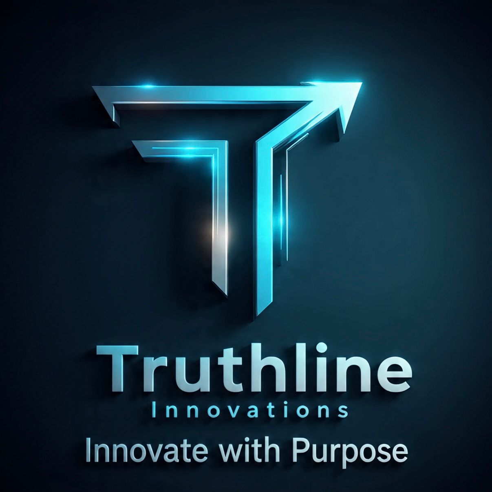

<!-- Profile Banner -->

  

<h1 align="center">Hi 👋, I'm Evans Kofi Assafuah</h1>
<h3 align="center">
  Web Developer • Mobile App Developer • IT Support Specialist
</h3>

<!-- Typing Animation -->

  

---

## 🚀 About Me
I’m a passionate developer who enjoys building clean, responsive, and user-friendly applications.  
I love transforming ideas into real-world solutions and growing through hands-on projects.

- 🌱 Currently learning **Flutter**
- 💡 Interested in **cybersecurity** & **scalable systems**
- 🛠 Focused on **web development, UI design & application logic**

---

## 🛠 Tech Stack

  
  
  
  
  
  
  
  
  
  

---

## 📌 Featured Projects

### 🛒 Shopping Cart Web App  
Full shopping system with database integration.

### 🌍 NGO Website  
Responsive donation-ready site supporting MoMo & Visa payments.

### 📰 News Hub  
Real-time campus news platform for students.

### 🎓 Educational Hub  
Student system with timetable, slides & academic calendar.

---

## 🤝 Open to Opportunities
I'm open to:
- Internships
- Freelance work
- Collaborations
- Learning opportunities

---

## 📊 GitHub Stats

  
  

---

## 📫 Connect With Me

  
  
  

---

  

